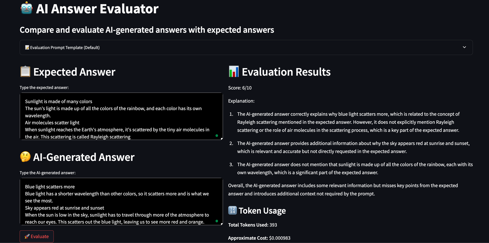

# LLM Answer Judge

[DEMO LINK](https://llm-judge.streamlit.app/)

LLM Answer Judge is a Streamlit app that evaluates AI-generated answers against expected answers using OpenAI's GPT models. The app provides a score and detailed feedback on the AI-generated response.

## Features

- **Customizable Prompt Template**: Modify the evaluation criteria using a default prompt template.
- **User Inputs**: Enter the expected answer and the AI-generated answer for comparison.
- **Evaluation Results**: Receive a score out of 10 with explanations of discrepancies, missing information, and errors.
- **Token Usage**: View the number of tokens used and an approximate cost of the evaluation.

## Requirements

- Python 3.x
- Streamlit
- OpenAI Python library
- OpenAI API key

## Installation

1. **Clone the repository** or download the `app.py` file.

2. **Install the required packages**:

   ```bash
   pip install streamlit openai python-dotenv
   ```

## Usage

1. **Run the Streamlit app**:

   ```bash
   streamlit run app.py
   ```

2. **Enter your OpenAI API key** in the sidebar.

3. **Customize the Prompt Template** (optional) by expanding the "Evaluation Prompt Template (Default)" section.

4. **Input the Expected Answer** and the **AI-Generated Answer** in their respective text areas.

5. **Click "Evaluate"** to get the evaluation results.

## License

This project is open-source and available under the MIT License.

## Screenshot



---

*Note: Usage of the OpenAI API may incur costs. Please refer to OpenAI's pricing for more details.*
